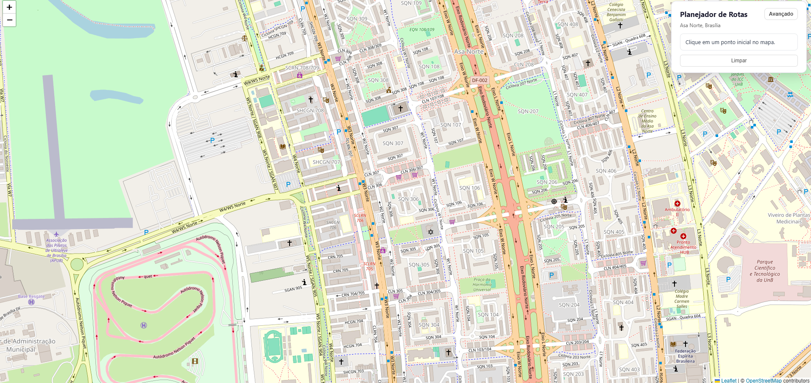
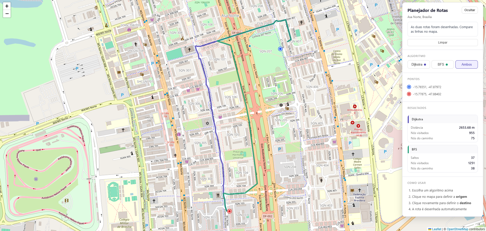
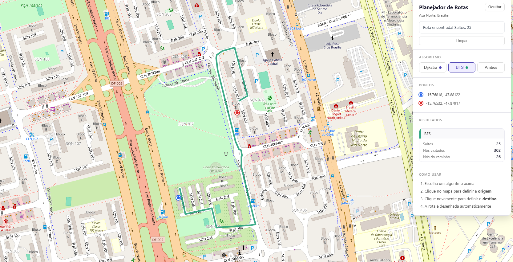

# G47_Grafos_PA-26.1
# Nome do Projeto

**Número da Lista**: 1<br>
**Conteúdo da Disciplina**: Grafos 1<br>

Link apresentação: https://youtu.be/wMVlRk-6DAw

## Alunos
| Matrícula | Aluno |
| -- | -- |
| 221022060 | Leonardo Fachinello Bonetti |
| 241025784 | João Paulo da Silva Pereira |

## Sobre 
Este projeto é uma aplicação web interativa que permite visualizar e comparar dois algoritmos de busca em grafos aplicados ao mapa real de ruas da Asa Norte, Brasília.
O grafo viário é extraído automaticamente do OpenStreetMap via osmnx. O usuário clica em dois pontos no mapa e a aplicação calcula e desenha a rota usando:

Dijkstra — encontra o caminho de menor distância total (em metros)
BFS (Busca em Largura) — encontra o caminho com o menor número de ruas percorridas (saltos)

Os dois algoritmos podem ser executados simultaneamente, permitindo comparar visualmente as rotas geradas por cada abordagem.

## Screenshots

*App sem nenhum ponto selecionado*


*Rotas selecionadas com Djistka e BFS ao mesmo tempo*


*Rota com somente BFS*

## Instalação 
**Linguagem**: Python 3.10+<br>
**Framework backend**: Flask<br>
**Frontend**: HTML + CSS + JavaScript (Leaflet.js, sem framework)<br>

Você pode instalar de duas formas:

Com make:
```bash
make install
```

Sem make:
```bash
python3 -m venv venv
source venv/bin/activate
pip install -r backend/requirements.txt
```

Para rodar o projeto:

Com make:
```bash
make run
```

Sem make:
```bash
source venv/bin/activate
python backend/app.py
```

## Uso 
1. Abra o navegador em [http://localhost:5000](https://unpkg.com/leaflet@1.9.4/dist/leaflet.js)
2. Clique em um ponto no mapa para definir a origem (marcador azul)
3. Clique em outro ponto para definir o destino (marcador vermelho)
4. A rota é calculada automaticamente e desenhada no mapa
5. Use o seletor de algoritmo para escolher entre:
   -Dijkstra — rota mais curta em distância
   -BFS — rota com menos ruas
   -Ambos — exibe as duas rotas simultaneamente para comparação


Clique em Limpar para reiniciar e escolher novos pontos

O painel de resultados mostra, para cada algoritmo:

Distância total (apenas Dijkstra)
Número de nós visitados durante a busca
Número de passos no caminho final

## Algoritmos Implementados
Ambos os algoritmos foram implementados do zero, sem uso das funções de caminho mínimo do NetworkX.
Dijkstra

Usa fila de prioridade (min-heap) via heapq
Peso das arestas: comprimento da rua em metros (length)
Garante o caminho de menor distância total

BFS (Busca em Largura)

Usa fila FIFO via collections.deque
Todas as arestas têm peso igual (1 salto)
Garante o caminho com menor número de arestas
